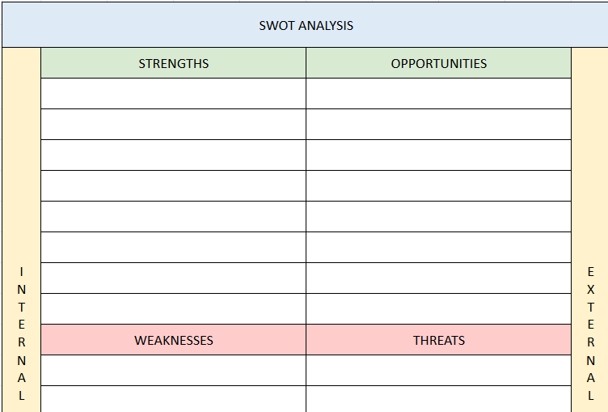
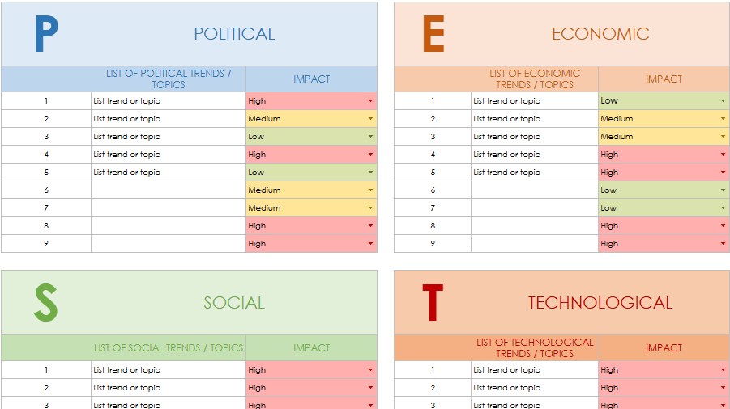

# Feature Prioritization Frameworks

**Purpose:**  
Provide a structured way to score and prioritize product ideas or features.

| File | Description |
|------|--------------|
[SWOT-Analyis.xlsx](https://github.com/user-attachments/files/23261441/SWOT-Analyis.xlsx) | A study to evaluate strengths, weaknessess, opportunities and threats of a product, feature, strategy etc. |
[PEST-Matrix.xlsx](https://github.com/user-attachments/files/23261444/PEST-Matrix.xlsx) | Framework to evaluate the external macro-environmental factors—Political, Economic, Social, and Technological—that may have an impact on a product, a strategy or an organisation. |

---

