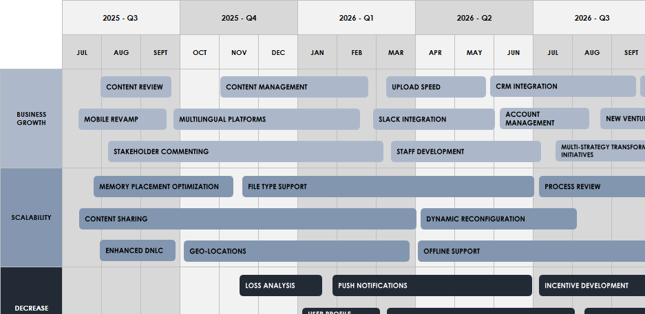

# Roadmap templates

**Purpose:**  
Provide a structured way to represent the roadmap of products or features.

| File | Description |
|------|--------------|
| [Multiple-Product-Roadmap-Template.xlsx](https://github.com/user-attachments/files/23261718/Multiple-Product-Roadmap-Template.xlsx) | Spreadsheet to visually represent multiple product roadmaps |
| [Agile-Product-Roadmap-Template.xlsx](https://github.com/user-attachments/files/23261722/Agile-Product-Roadmap-Template.xlsx) | Spreadsheet to visualize a product roadmap in an Agile context |
| [Features-Roadmap-Template.xlsx](https://github.com/user-attachments/files/23261723/Features-Roadmap-Template.xlsx) | Spreadsheet to represent the roadmap at feature level |

---
